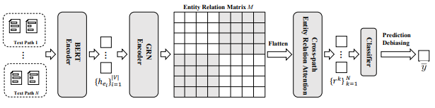

# CoRE-NEPD
This repository contains the code for the paper "Towards Better Graph-based Cross-document Relation Extraction via Non-bridge Entity Enhancement and Prediction Debiasing" (Findings of ACL 2024, [📃arXiv Paper](https://arxiv.org/abs/2406.16529)).

## Illustration of Framework



## Requiremnets
Follow the guideliens from : https://github.com/thunlp/CodRED
## Directory structure
`data`: Directory for data

`ours`: Directory for code

`ours/main.py`: File for training/validate
## Dataset
All of the dataset files are in ```./dataset/```

please add [dsre_train_example.json] (https://drive.google.com/file/d/1_E0V6ljMu-J6s3O7AUmdRdxhKBFTlJBv/view?usp=sharing) to ```./dataset/```

Note that we also provide the dataset for open setting in ```./dataset/open_setting_data/```, following https://github.com/luka-group/MrCoD

For data preparation and processing steps, please refer to https://github.com/thunlp/CodRED
## Saved Models
We also provide checkpoints for convenient.
| Model       | Link                                         |
| ----------- | -------------------------------------------- |
| Ours w/o y_bias,y_rela | [Download](https://drive.google.com/drive/folders/1XlLg7ruHUa8WrbZ8n_Lci-sAe42R1JVT?usp=drive_link) |
|  y_rela Classifer      | [Download](https://drive.google.com/drive/folders/1hbI01FVuuV6NwKaUecKMeXp3qE-V3r7j?usp=drive_link) |

Here are examples for model inference (you can modify the ours/train.sh for inference):

- Ours full model:
```
CUDA_VISIBLE_DEVICES=0 python main.py --dev --test --load_checkpoint "checkpoint path for w/o y_bias,y_rela*checkpoint for y_rela classifer" --per_gpu_train_batch_size 1 --per_gpu_eval_batch_size 1 --learning_rate 3e-5 --epochs 1
```
- Ours w/o y_bias,y_rela:
```
CUDA_VISIBLE_DEVICES=0 python main.py --dev --test --load_checkpoint "checkpoint path for w/o y_bias,y_rela" --per_gpu_train_batch_size 1 --per_gpu_eval_batch_size 1 --learning_rate 3e-5 --epochs 1
```
